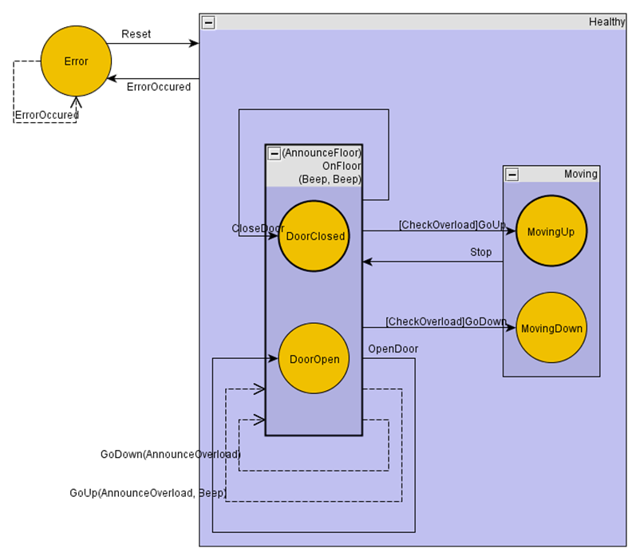

# Reports
Reports can be used to check whether your state machine implementation is correct and for documentation purposes. There are different built-in reports. And you can implement your own report by implementing `IStateMachineReport`.

To get reports with meaningful action names, you should always specify methods in the state machine definition instead of lambda expressions. Lambda expressions will only be reported as anonymous methods.

A report can be created by calling `Report` on a state machine a pass in a report generator.

```c#
stateMachine.Report(myReportGenerator);
```

## Built-in Reports

## yEd Report
*The yEd Report is currently broken due to an update in yEd.*
The yEd report generates a file that can be opened with [yEd](https://www.yworks.com/yed-live/). This report contains states, events, transitions with guards and actions.



```c#
TextWriter textWriter = ...
var generator = new YEdStateMachineReportGenerator<States, Events>(textWriter);
stateMachine.Report(generator);
```

## csv Report
The csv report creates two `.csv` files. One containing the states with sub-states, entry and exit actions. And another file containing information about transitions with guards and actions.

| Source     | Entry         | Exit       | Children             |
|------------|---------------|------------|----------------------|
| OnFloor    | AnnounceFloor | Beep, Beep | DoorClosed, DoorOpen |
| Moving     |               |            |	MovingUp, MovingDown |
| Healthy    |               |            | OnFloor, Moving      |
| MovingUp   |               |            |                      |
| MovingDown |               |            |                      |
| DoorClosed |               |            |                      |
| DoorOpen   |               |            |                      |
| Error      |               |            |                      |

| Source      | Event        | Guard         | Target              | Actions                |
|-------------|--------------|---------------|---------------------|------------------------|
| OnFloor     |	CloseDoor    |               | DoorClosed          |                        |
| OnFloor     |	OpenDoor     |               | DoorOpen	           |                        |
| OnFloor     |	GoUp         | CheckOverload | MovingUp            |                        |
| OnFloor     |	GoUp         |               | internal transition | AnnounceOverload, Beep |
| OnFloor     |	GoDown       | CheckOverload | MovingDown          |                        |
| OnFloor     |	GoDown       |               | internal transition | AnnounceOverload       |
| Moving      |	Stop         |               | OnFloor             |                        |
| Healthy     |	ErrorOccured |               | Error               |                        |
| Error	      | Reset        | Healthy       |                     |                        |
| Error       |	ErrorOccured |               | internal transition |                        |

TextWriter statesWriter = ...
TextWriter transitionsWriter = ...
var generator = new CsvStateMachineReportGenerator<States, Events>(statesWriter, transitionsWriter);
stateMachine.Report(generator);

## Textual State Machine Report
The textual report is the only report containing all information about the state machine including history types.

```
Elevator: initial state = OnFloor
    Healthy: initial state = OnFloor history type = Deep
        entry action: 
        exit action: 
        ErrorOccured -> Error actions:  guard: 
        OnFloor: initial state = DoorClosed history type = None
            entry action: AnnounceFloor
            exit action: Beep, Beep
            CloseDoor -> DoorClosed actions:  guard: 
            OpenDoor -> DoorOpen actions:  guard: 
            GoUp -> MovingUp actions:  guard: CheckOverload
            GoUp -> internal actions: AnnounceOverload, Beep guard: 
            GoDown -> MovingDown actions:  guard: CheckOverload
            GoDown -> internal actions: AnnounceOverload guard: 
            DoorClosed: initial state = None history type = None
                entry action: 
                exit action: 
            DoorOpen: initial state = None history type = None
                entry action: 
                exit action: 
        Moving: initial state = MovingUp history type = Shallow
            entry action: 
            exit action: 
            Stop -> OnFloor actions:  guard: 
            MovingUp: initial state = None history type = None
                entry action: 
                exit action: 
            MovingDown: initial state = None history type = None
                entry action: 
                exit action: 
    Error: initial state = None history type = None
        entry action: 
        exit action: 
        Reset -> Healthy actions:  guard: 
        ErrorOccured -> internal actions:  guard: 
```

```c#
var generator = new StateMachineReportGenerator<States, Events>();
stateMachine.Report(generator);
string report = generator.Result;
```